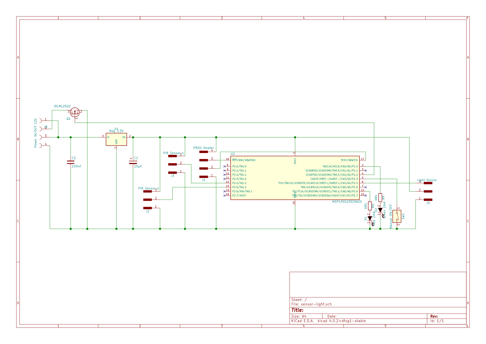
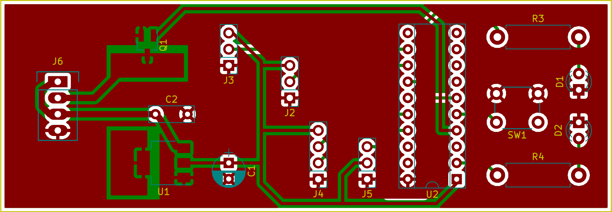

## LED strip light controller ##

The project is to drive night lighting of a staircase using PIR
motion sensors (two: for the top and bottom of the staircase).
Ambient light sensor to only turn the LED chain when it is dark.
Driven by MSP430 MCU, light power controlled via PWM + MOSFET.

